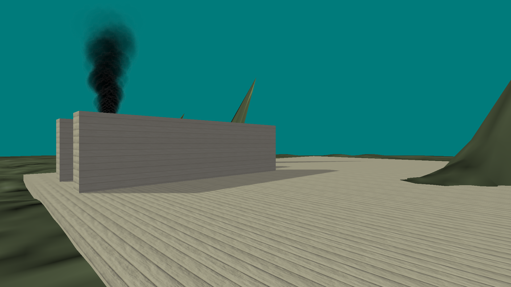

modelr
======

A model renderer written by me to learn OpenGL and 3D graphics.

Features
--------

* Uses modern OpenGL (4.4+)
* VBO/VAO-meshes
* Materials
    * Diffuse maps
    * Normal maps
* Phong lighting model

Planned features
----------------

* !!! Transparent material support
* !!! Mesh vertex attribute indexing
* View frustum culling (GLSL-side, if possible)
* SSAO
* Occlusion culling, if possible
* Dynamic terrain loading/rendering, preferrably from heightmap
* More optimizations
* Debugging helpers - trajectories
* Maybe physics like collisions/gravity
